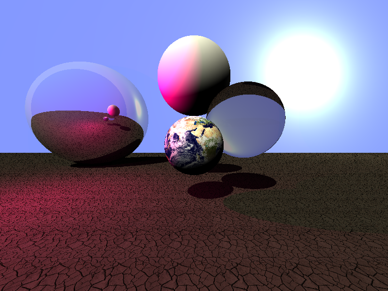

# raingun

A little ray tracer implementation for learning about Ray Tracers.

This project is based on the tutorial presented on [bheisler's
blog][tutorial] and additional details from
[Scratchapixel][scratchapixel].

## Example image



## Building and running

Use `cargo` to run and build this project.

```bash
# To compile and run release build
cargo run --release -- --help

# Passing arguments to the command
cargo run -- --help

# Running tests
cargo test --all
```

## License

A lot of the code is Copyright © 2017 Brook Heisler, released under MIT license.

The rest of the code is Copyright © 2017 Magnus Bergmark, released under the MIT license.

[tutorial]: https://bheisler.github.io/post/writing-raytracer-in-rust-part-1/
[scratchapixel]: https://bheisler.github.io/post/writing-raytracer-in-rust-part-1/
